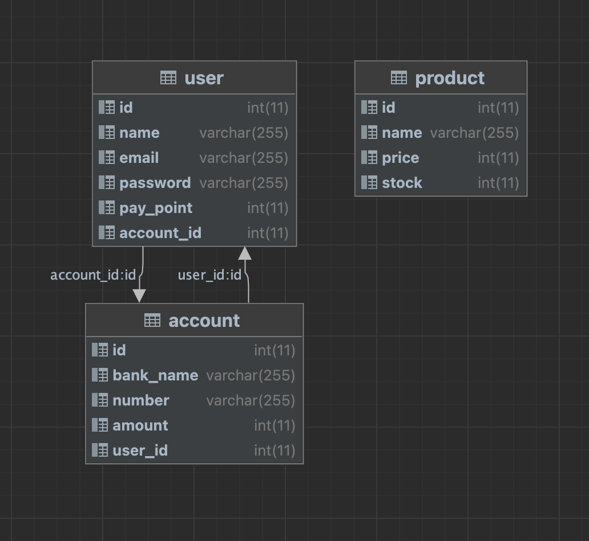

# 2023_Point_Benefit_FE_Internship_1st

네이버 페이의 현장 결제 서비스를 `mocking` 한 서비스를 개발합니다.

<p align="center">
    
    <p align="center">현장 결제 서비스 이미지</p>
</p>

## 1. 로컬 실행 방법

```bash
git clone https://oss.navercorp.com/PayFE/2023_Point_Benefit_FE_Internship_1st.git

git checkout develop

```

### 실행 환경

```bash
node -v // 14.16.1
```

### 실행 방법 (Backend)

-   DB 설치

    본인 디바이스 설치 방법을 따라 [`Maria DB`](https://mariadb.org/download/?t=mariadb&p=mariadb&r=11.0.0)를 설치하시면 됩니다.

    (⚠️ 디비를 설치하신 후 환경 변수를 통해 백엔드 서버와 연동하시게 되면 서버 실행과 동시에 테이블을 생성합니다. 따라서 별도의 DB Scheme 설정은 필요하지 않습니다.)

-   환경 변수

    ```json
    // 본인의 로컬 DB 정보를 기입한다.
    DB_HOST="$HOST"
    DB_PORT=$PORT
    DB_USER="$USER"
    DB_PASSWORD="$PASSWORD"
    DB_DATABASE="$DATABASE_NAME"

    // JWT_PRIVATE_KEY는 아무렇게나 generate 해주세요 (e.g. asfidjsaifvihsdiav)
    JWT_PRIVATE_KEY="$JWT_PRIVATE_KEY"
    ```

-   구동 명령어

    ```bash
    // root repository 에서

    yarn

    yarn server start
    ```

### 실행 방법 (Frontend)

-   구동 명령어

    ```bash
    // root repository 에서

    yarn

    yarn client start
    ```

## 2. 백엔드

### DB Scheme

<p align="center" style="padding:10px;">
    
    <p align="center">DB 스키마 이미지</p>
</p>

### API Scheme

<p align="center" style="padding:100px;">
<button name="button" style="font-size:20px; background-color:#36A779; color:white; border-radius:12px; padding:15px; cursor:pointer;" onclick="https://oss.navercorp.com/PayFE/2023_Point_Benefit_FE_Internship_1st/docs/API_DOCS.md">API 명세 확인하기</button>

</p>

## 3. 서비스 시나리오 (가정 : 상품을 선택 후 매장의 결제 현장)

### Customer

    a. 사용자가 웹앱에 접근한다.

    b. 로그인 되어있지 않다면 ⇒ 로그인 페이지에 접근 ( 혹은 로그인 페이지가 아닌 경우 `redirect`)

        b-1. 로그인

    c. 로그인이 되어 있다면 ⇒ QR 현장 결제 페이지

### Clerk

    a. QR 코드를 점원이 찍는다.

    b. QR URL 페이지에서 사용자가 가져온 상품들을 선택해준다. (현실에서 바코드를 찍는 행위이다. 실수할 여지 없으므로 이런식으로 가정이 가능)

    c. 결제 버튼 클릭

        c-1. 잔액이 없으면, 연동된 사용자의 계좌에서 자동 충전되어 결제가 된다.

        c-2. 연동된 사용자의 계좌가 없다면 결제 실패 피드백을 준다.

    d. 사용자, 점원에게 결제 피드백이 간다.

## 4. 디자인

<p align="center" style="padding:100px;">
<button name="button"style="font-size:20px; background-color:#36A779; color:white; border-radius:12px; padding:15px; cursor:pointer;" onclick="https://www.figma.com/file/Ugz9cPI4BV06I1bTQnVt9v/NFP?node-id=0%3A1&t=MckBLduyv7ixmEaP-0"><span style="font-size:20px">와이어 프레임 확인하기<span></button>

</p>
