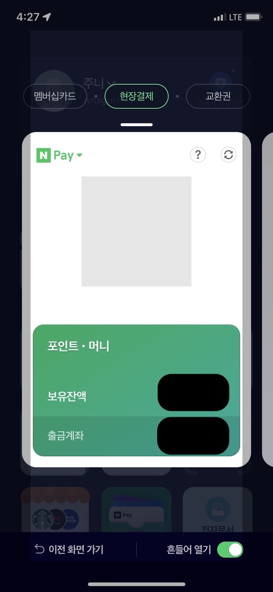

# 2023_Point_Benefit_FE_Internship_1st

## 1. 소개

네이버 페이의 현장 결제 서비스를 `mocking` 한 서비스를 개발합니다.

<p align="center">
    
    <p align="center">현장 결제 서비스 이미지</p>
</p>

## 2. 실행 환경

```bash
node -v // 14.16.1
```

## 3. 실행 방법

```bash
git clone https://oss.navercorp.com/PayFE/2023_Point_Benefit_FE_Internship_1st.git

git checkout feature/all-project-setup#6

yarn // 패키지 의존성 재설치

yarn server start // 서버를 시작합니다.
yarn client start // 클라이언트(리액트 웹 어플리케이션)를 시작합니다.
```

## 4. 서비스 시나리오 (가정 : 상품을 선택 후 매장의 결제 현장)

-   Customer (서비스로 현장 결제를 하는)
-   Clerk (점원)

### Customer

1.  사용자가 웹앱에 접근한다.

1.  로그인 되어있지 않다면 ⇒ 로그인 페이지에 접근 ( 혹은 로그인 페이지가 아닌 경우 `redirect`)
    1. 로그인
1.  로그인이 되어 있다면 ⇒ QR 현장 결제 페이지

### Clerk

1. QR 코드를 점원이 찍는다.
2. QR URL 페이지에서 사용자가 가져온 상품들을 선택해준다. (현실에서 바코드를 찍는 행위이다. 실수할 여지 없으므로 이런식으로 가정이 가능)
3. 결제 버튼 클릭
    1. 잔액이 없으면, 연동된 사용자의 계좌에서 자동 충전되어 결제가 된다.
    2. 연동된 사용자의 계좌가 없다면 결제 실패 피드백을 준다.
4. 사용자, 점원에게 결제 피드백이 간다.

### 디자인

[링크](https://www.figma.com/file/Ugz9cPI4BV06I1bTQnVt9v/NFP?node-id=0%3A1&t=MckBLduyv7ixmEaP-0)에 와이어프레임을 작성해두었습니다.
