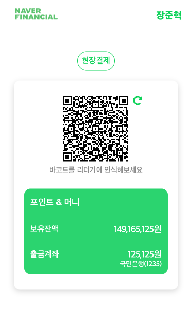
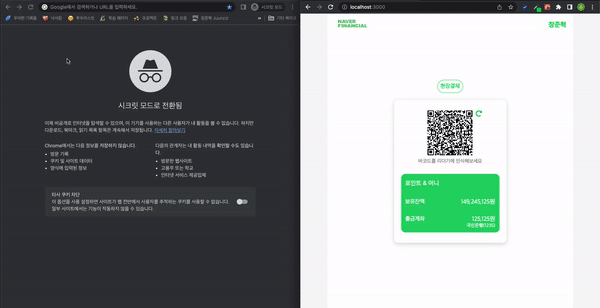
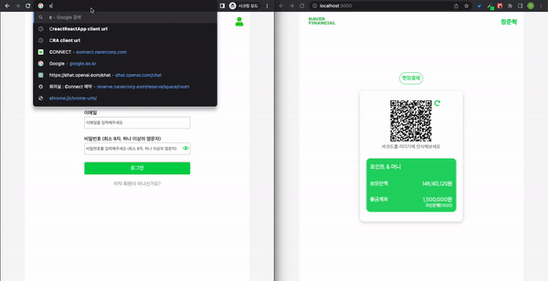
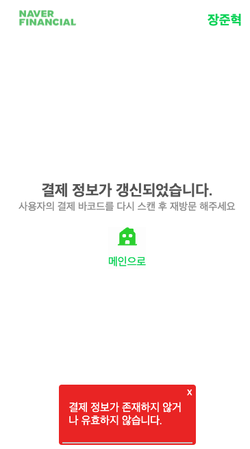
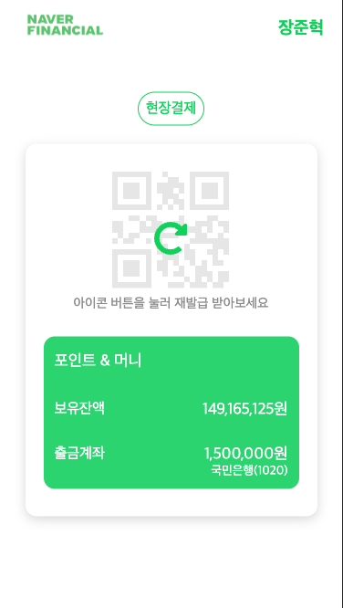
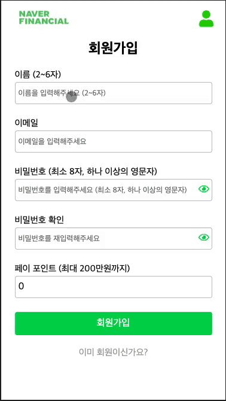
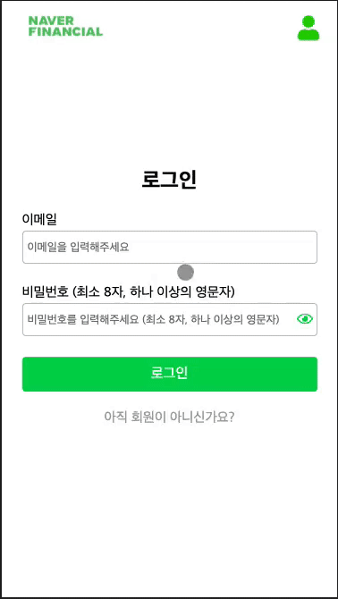
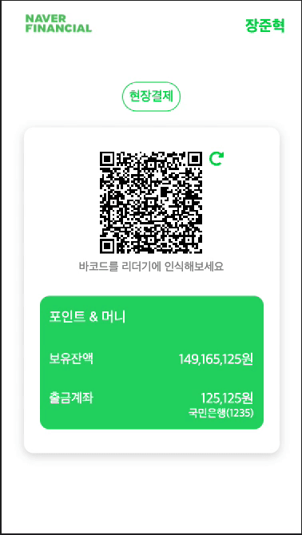

# 목차

1. [로컬 실행 방법](#1-로컬-실행-방법)
2. [결과물](#2-결과물)
3. [역할 및 수행 기간](#3-역할-및-수행-기간)
4. [프로젝트 구조](#4-프로젝트-구조)
5. [프로젝트에서 내가 추구했던 것들](#5-프로젝트에서-내가-추구했던-것들)
6. [결제 상태에 따른 점원, 유저 화면의 동기화 작업](#6-결제-상태에-따른-점원-유저-화면의-동기화-작업)
7. [인턴 기간 동안의 나](#7-인턴-기간-동안의-나)
8. [업무 간 문서화 목록](#8-업무-간-문서화-목록)

# 개요

네이버 페이의 현장 결제 서비스를 follow 한 나만의 현장 결제 서비스를 개발하였습니다.

<p align="center">
    
    <p align="center">프로젝트 현장 결제 서비스 - 메인 화면</p>
</p>

# 1. 로컬 실행 방법

### 실행 환경

```bash
node -v // 14.16.1
```

### 프로젝트 클론

```bash
git clone https://oss.navercorp.com/PayFE/2023_Point_Benefit_FE_Internship_1st.git
```

### 실행 방법 (Backend)

-   DB 설치

    본인 디바이스의 [`Maria DB`](https://mariadb.org/download/?t=mariadb&p=mariadb&r=11.0.0) 설치 방법을 따라 설치하시면 됩니다.

    (⚠️ MariaDB를 설치하신 후 환경 변수를 통해 백엔드 서버와 연동하시게 되면 서버 실행과 동시에 테이블을 생성합니다. 따라서 별도의 DB Scheme 설정은 필요하지 않습니다.)

-   환경 변수

    ```js
    // 본인의 로컬 DB 정보를 기입한다.
    DB_HOST = 'localhost'
    DB_PORT = 3306
    DB_USER = 'root'
    DB_PASSWORD = '960713hj'
    DB_DATABASE = 'payment'
    JWT_PRIVATE_KEY = 'afdsasdgasdgxczzxv125assfdxcvzxczv'
    ```

-   구동 명령어

    ```bash
    // root repository 에서

    yarn

    yarn server start
    ```

### 실행 방법 (Frontend)

-   환경 변수

    ```js
    REACT_APP_API_URL = 'http://localhost:8080'
    // 모바일 카메라로 QRCODE 인식 시 이동할 로컬 주소입니다.
    // 모바일 테스트를 원하시면 본인 IP주소(포트는 3000)를 기입해주셔야합니다.
    REACT_APP_CLIENT_URL = 'http://localhost:3000'
    REACT_APP_CUSTOMER_KEY = '123456'
    ```

-   구동 명령어

    ```bash
    // root repository 에서

    yarn

    yarn client start
    ```

# 2. 결과물

<p align="center">
    
    <p align="center">[왼쪽부터 점원, 유저 화면] 현장 결제 기능</p>
</p>

<p align="center">
    
    <p align="center">[왼쪽부터 점원, 유저 화면] 현장 결제 기능 (결제 취소 상황)</p>
</p>

<p align="center">
    
        
    <p align="center">[왼쪽부터 점원, 유저 화면] 현장 결제 기능 (결제 토큰 만료 상황)</p>
</p>

<p align="center">
    
    
    
    <p align="center">[왼쪽부터 로그인, 회원가입, 로그아웃] 인증 기능</p>
</p>

<p align="center">
    
    <p align="center">계좌 생성 기능</p>
</p>

<p align="center">
    
    
    <p align="center">[왼쪽부터 메인, 계좌 생성] 페이지 별 Loading UI (일부만 첨부)</p>
</p>

# 3. 역할 및 수행 기간

총 프로젝트의 수행 시간은 업무일 기준 **23일이 소요**되었으며, **23년 1월 19일 ~ 23년 2월 23일** 기간 동안 프로젝트를 수행하였습니다. 별도의 백엔드 개발자, UI/UX 디자이너, 기획자가 존재하지 않는 프로젝트였기에 모든 영역에서 그 역할을 다하였는데, 내용은 다음과 같습니다.

### 백엔드

**업무일 기준 10일의 시간을 소요하였습니다.** `Node JS` 기반의 API 서버를 개발하였으며, 데이터베이스는 MariaDB를 사용하였습니다. 현재 상정했던 도메인 영역(User, Account, Order, Product)의 API 개발을 완료하였습니다. [API 명세](https://evanescent-beechnut-9b3.notion.site/API-2c767ea6e843420ca6526b14be1cbe45), [DB Scheme](https://evanescent-beechnut-9b3.notion.site/DB-Scheme-Design-1f6167f5a9c840c583e5d2c393bdc443) 등은 하이퍼 링크를 클릭하시어 확인하실 수 있습니다.

### 프론트엔드

**업무일 기준 11일의 시간을 소요하였습니다.** `React` 기반의 웹 어플리케이션을 개발하였으며, 상정했던 도메인 영역(User, Account, Order, Product)의 UI 개발을 완료하였습니다. 다양한 써드 파티 기술들을 사용하기 보단 네이티브 하게 구현할 수 있는 것들은 **직접 구현하며 개발** 을 진행하였고, UI 역시 **사용자 경험을 놓치지 않은 UI를 개발** 하고자 하였습니다. 이들에 대한 자세한 설명은 [프로젝트에서 내가 추구한 것들](#5-프로젝트에서-내가-추구했던-것들)에서 서술합니다.

### 기획

**업무일 기준 1일의 시간을 소요하였습니다.** 최초 아이디어를 TL 님이신 광민 님으로부터 전달받은 후 실제 네이버 현장 결제 서비스 분석, 유저 [시나리오 작성 작업](https://evanescent-beechnut-9b3.notion.site/f06647045be84581921f2184bed26087) 등을 해보며 추상적이었던 **최초 기획 사항을 구체화** 해보았습니다.

### 디자인

**업무일 기준 1일의 시간을 소요하였습니다.** [Figma 툴](https://www.figma.com/file/Ugz9cPI4BV06I1bTQnVt9v/NFP?node-id=0%3A1&t=vnf8GYC4f2msvGsG-0)을 활용해 UI 디자인을 실시하였으며, 완벽한 디자인을 목표로 하기보단 최소 기능 프로덕트 개발이라는 프로젝트 목표에 맞게 빠른 기능 개발을 우선적으로 하기 위해 **와이어 프레임만을 작성**하였습니다.

# 4. 프로젝트 구조

> <i>🙋 본문에는 **모듈**이라는 용어가 자주 등장합니다. 컴퓨팅 세계에서 **모듈**은 하나의 기능을 수행할 수 있도록 구현된 독립적인 개체라는 의미를 갖습니다. 하지만 **자바스크립트에서 모듈은 그러한 의미에 더하여 하나의 파일이라는 의미**를 갖기도 한다 알고 있습니다. 본문에서는 독립적인 개체 + 하나의 파일이라는 의미를 바탕으로 **모듈**이라는 용어를 사용합니다. 이해에 무리가 없으셨으면 합니다 !</i>

이번 프로젝트는 `Yarn Berry` 패키지 매니저 기반의 모노 레포 환경으로 구성되어 있습니다. 그렇기에 `server` 프로젝트, `client` 프로젝트, `common` 프로젝트 세 개의 프로젝트 하나의 레포에서 관리되고 있습니다. 영역 별 프로젝트 구조 (디렉터리 의미, 모듈 배치 등)은 다음과 같습니다.

### 백엔드 (payment server project)

모듈이 수행하는 기능을 기준으로 응집시키기보단 모듈이 속하게 되는 **데이터 모델 영역을 기준으로 모듈들을 응집**시켜보았습니다. 폴더 구조는 다음 Code Block과 같습니다. (비즈니스 로직이 담긴 @domains 폴더의 내용에 대해서만 첨부합니다.)

```bash
├── src
│   ├── @domains
│   │    ├── account
│   │    │    ├── router.ts
│   │    │    ├── service.ts
│   │    │    ├── type.ts
│   │    │    └── modules
│   │    │        ├── query.ts
│   │    │        └── validation.ts
│   │    ├── order
│   │    │    ├── router.ts
│   │    │    ├── service.ts
│   │    │    ├── type.ts
│   │    │    └── modules
│   │    │        ├── util.ts
│   │    │        └── validation.ts
│   │    ├── product
│   │    │    ├── router.ts
│   │    │    ├── service.ts
│   │    │    ├── type.ts
│   │    │    └── modules
│   │    │        └── query.ts
│   │    ├── user
│   │    │    ├── router.ts
│   │    │    ├── service.ts
│   │    │    ├── type.ts
│   │    │    └── modules
│   │    │        ├── jwt.ts
│   │    │        ├── middleware.ts
│   │    │        ├── payment-token-store.ts
│   │    │        ├── query.ts
│   │    │        └── validation.ts
```

-   **`@domains`** : **비즈니스 로직이 선언되어 있는 모듈들이 배치되어 있는 폴더**입니다. 서비스의 중추 폴더라고 할 수 있습니다.

-   **`@domains/[data-model]`** : `@domains` 폴더 하위에는 데이터 모델 영역을 기준으로 생성된 폴더들이 존재합니다.

    -   **`router.ts`** : `[data-model]` 폴더 하위에는 하나의 `router.ts` 파일이 존재합니다. **API의 엔드포인트 별로 선언된 `API Handler` 가 작성, 바인딩** 되어있습니다. 사용자의 요청을 최초 받아내는 역할을 수행합니다.

    -   **`service.ts`** : `[data-model]` 폴더 하위에는 하나의 `service.ts` 파일이 존재합니다. **실제 DB 작업을 트리거하는 등 비즈니스 로직이 선언되어 있는 모듈**입니다.

    -   **`type.ts`** : `[data-model]` 폴더 하위에는 하나의 `type.ts` 파일이 존재합니다. **데이터 모델 영역에서 작성될 타입들이 선언**되어 있는 모듈입니다.

    -   **`modules`** : 데이터 모델 영역의 `router` 로직, `service` 로직이 작성됨에 있어 **부차적으로 필요한 모듈들이 선언**되어 있는 폴더입니다. 하위에는 `middleware`, `util func`, `DB query func` 등이 선언되어 있는 모듈들이 존재합니다.

### 프론트엔드 (payment client project)

백엔드 프로젝트와 마찬가지로 모듈의 기능을 기준으로 응집시키기보단, 모듈들이 속하는 **데이터 모델 영역을 기준으로 모듈을 응집**시켰습니다. 프론트엔드 프로젝트의 구조는 다음과 같습니다. (UI 모듈들이 담긴 `@page, @components`, UI가 트리거하는 비즈니스 로직이 담긴 `@domains` 폴더에 대해서만 첨부합니다.)

```bash
// Business 모듈이 담긴 @domains Code Block

├── src
│   ├── @domain
│   │    ├── account
│   │    │    │── api.ts
│   │    │    │── hooks.ts
│   │    │    └── type.ts
│   │    ├── order
│   │    │    │── api.ts
│   │    │    │── hooks.ts
│   │    │    └── type.ts
│   │    ├── product
│   │    │    │── api.ts
│   │    │    │── hooks.ts
│   │    │    └── type.ts
│   │    ├── user
│   │    │    │── api.ts
│   │    │    │── hooks.ts
│   │    │    └── type.ts
│   │    └── module
```

-   **`@domain`** : **외부 데이터를 조작하거나 불러오는 기능을 수행하는 등 서비스 모듈들이 배치되어 있는 폴더**입니다. 프로젝트의 단일개로 존재하며 하위에는 데이터 모델 영역으로 구분된 폴더들이 존재합니다.

-   **`@domain/[data-model]`** : 각 **데이터 모델에서 작성될 서비스 모듈들이 배치되어 있는 폴더**입니다. 기본적으로 `api.ts`, `hooks.ts`, `type.ts` 모듈들이 선언되어 있습니다.

    -   **`api.ts`** : 실제 **외부 데이터와 관련된 비동기 요청 (Ajax) 함수들이 선언되어 있는 모듈**입니다. 네트워크 요청을 위해 `axios` 라이브러리를 사용하였으므로 `axios` 기술 기반으로 작성된 함수들이 선언되어 있습니다.

    -   **`hooks.ts`** : 외부 데이터를 컴포넌트 코드에서 참조하거나 조작할 수 있도록 **`React Hook API` 기반으로 작성된 커스텀 훅**들이 선언되어 있는 모듈입니다.

        -   외부 데이터의 참조 (`useFetch ~~`): `React Query` 의 `UseQuery API` 를 기반으로 작성된 커스텀 훅

        -   외부 데이터의 조작 (`useMutate ~~`) : `api.ts`에 선언된 함수를 기반으로 추상화된 함수가 선언되어 있는 커스텀 훅

    -   **`type.ts`** : 프론트엔드 서비스 코드에서 사용될 타입들이 선언되어 있습니다. 해당하는 **데이터 모델 영역의 타입들이 선언**되어 있습니다.

```bash
// UI 모듈이 담긴 @components, @pages Code Block

├── src
│   │── @pages
│   │    └── A Page
│   │         │── index.tsx
│   │         │── hooks.ts
│   │         │── style.tsx
│   │         │── loading-fallback.tsx
│   │         └── error-fallback.tsx
│   ├── @components
│   │    ├── account
│   │    │    └── A Component
│   │    │         │── index.tsx
│   │    │         │── hooks.ts
│   │    │         │── style.tsx
│   │    │         │── loading-fallback.tsx
│   │    │         └── error-fallback.tsx
│   │    ├── order
│   │    ├── product
│   │    ├── user
│   │    └── common
```

-   **`@pages`** : 페이지 컴포넌트가 배치되어 있는 폴더입니다.

-   **`@components`** : 페이지 컴포넌트에서 사용될 UI 컴포넌트가 배치되어 있는 폴더입니다. 하위에는 데이터 모델 기준으로 작성된 폴더와 `common` 폴더 들이 존재합니다.

-   **`@components/common`** : 도메인에 귀속되지 않은, 프로젝트 전반에서 사용되는 UI 컴포넌트가 배치되어 있는 폴더입니다. (e.g. Toast, Modal, ErrorBoundary, PageTemplate 등)

-   **`@components/[data-model]`** : `@components` 폴더 내부에는 데이터 모델 별로 각각 폴더가 하나씩 존재합니다. 도메인에 귀속된 컴포넌트들은 `@components`의 각자 속하는 데이터 모델 영역 폴더에 배치됩니다.

    -   **`index.tsx`** : 페이지 혹은 UI 컴포넌트 폴더에는 Main Resource인 `index.ts` 모듈이 단일개로 존재합니다. 해당 모듈 파일에는 `hooks.ts`, `style.ts`, `loading-fallback.ts`, `error-fallback.ts` 들에 선언된 함수들을 사용하여 작성된 컴포넌트 코드가 선언되어 있습니다.

    -   **`hooks.ts`** : 해당 컴포넌트 코드에서 작성될 **기능** 코드가 담겨 있는 모듈입니다. `React Hook API` 기반으로 작성된 커스텀 훅들이 배치되어 있습니다. UI가 갖게 되는 기능이 강하게 결합되지 않도록 하기 위해 별도의 `Hook` 으로 컴포넌트의 기능을 분리하여 관리합니다. (기능의 재사용성 ✅, 관심사의 분리 ✅)

    -   **`style.tsx`** : UI 컴포넌트에서 사용될 스타일 코드가 작성되어 있는 모듈입니다.

    -   **`loading-fallback.tsx`** : UI 컴포넌트에서 사용될 비동기 요청, 혹은 컴포넌트의 lazy loading 시 Pending 상태의 UI를 표현하는 컴포넌트 코드가 작성되어 있는 모듈입니다.

    -   **`error-fallback.tsx`** : UI에서 사용될 비동기 요청 혹은 컴포넌트의 lazy loading 시 Failure 상태의 UI를 표현하는 컴포넌트 코드가 작성되어 있는 모듈입니다.

# 5. 프로젝트에서 내가 추구했던 것들

## A. 같이 일하는 사람을 배려하며

함께 일하는 태희님에게 프로젝트 코드를 리뷰 받을 때 가장 신경 쓴 부분은 **같이 일하는 사람을 배려하며**였습니다. 이를 위해 리뷰를 받을 때면 PR 코멘트에 항상 결과물 화면, 공유 사항들을 남기어 제가 무슨 작업을 했는지, 어떤 의도를 가지고 만든 결과물인지를 [다음과 같이](https://oss.navercorp.com/PayFE/2023_Point_Benefit_FE_Internship_1st/pull/78#issue-5574025) 기록하곤 하였습니다. 코드로 말하는 것이 개발자이지만, 읽는 이로 하여금 더 쉽게 이해하는 길은 직접 생각을 표현하는 일일 것이라 생각하여 **PR 코멘트는 항상 자세하게 작성토록 노력**했습니다!

또한, 과거 프로젝트 경험에서 같이 일하는 개발자와 지켰으면 했던 것들을 이번 프로젝트에서 몸소 실천해 보며 **팀원을 배려하고자 하였습니다.** 구체적으로, PR 리뷰 사항을 반영하는 커밋은 [다음과 같이](https://oss.navercorp.com/PayFE/2023_Point_Benefit_FE_Internship_1st/pull/70#discussion_r2622586) 직접 링크로 달아 상대방으로 하여금 **커밋 로그**를 보아야 하는 귀찮음을 경험하지 않도록 하였고, 의도가 명확히 존재할 땐 **왜 혹은 나의 생각, 방안에 대해서** [항상 자세히 표현](https://oss.navercorp.com/PayFE/2023_Point_Benefit_FE_Internship_1st/pull/78#discussion_r2631624)하여 상대방이 한 번 더 질의하지 않아도 되게끔 리뷰에 임했습니다. 같이 일하는 사람이 이해하기 쉽도록 **코드 구조의 일관성**을 항시 지키려고 노력하였습니다. (e.g. 모듈 배치의 일관성)

## B. Native 하게 구현할 수 있는 것들은 직접 구현한다

`Toast UI`, `Modal UI`, `Loading UI`, `Button`, `Input` 등 서비스 도메인에 귀속되지 않는 UI들은 써드 파티 라이브러리를 사용하여 이를 쉽게 구현할 수 있습니다. 굳이 UI 영역으로 한정 짓지
않더라도 비동기 요청의 중복을 허용하지 않게 하는 로직, 외부 데이터를 조작하기 위해 비동기 요청을 보내는 훅들은 다른 라이브러리의 기술을 활용하여 쉽게 구현할 수 있습니다.

하지만 저는 이러한 개발 방식이 **기술 적용에 대한 학습 비용**, **문제 해결 비용**, **프로덕트의 책임감** 등의 영역에서 부정적인 영향력을 미칠 수 있다고 생각하기에 **개발이 가능한 영역은 직접 개발하는 방식**을 선호합니다. 개발이 가능한 부분인데도, 다른 기술에 의존하게 되어버리면 **기술을 적용하기 위해 학습**해야하는 비용, **문제가 발생하게 되면 기술의 문제 해결 방식에 의존하여 문제를 해결**하는 트러블 슈팅 플로우를 감수 해야합니다. 또한, 직접 구현한 것이 아니기 때문에 해당 영역에서 개발자의 **책임감이 다소 떨어질지도 모릅니다.** (Build 될 결과물의 사이즈가 불필요하게 커진다는 성능 관점에서의 문제점도 있을 수 있겠군요 !) 따라서 전 사소한 영역까지 여러 기술을 활용하여 개발하기보단 **직접 개발이 가능한 부분에 대해선 손수 개발하며 프로젝트를 진행**해보았습니다.

저는 직접 개발이 가능한 부분들은 손수 개발하며 프로젝트를 진행하였습니다. [`Toast UI`](https://oss.navercorp.com/PayFE/2023_Point_Benefit_FE_Internship_1st/tree/develop/packages/client/src/%40components/common/Toast), [`네트워크 중복 요청 방지`](https://oss.navercorp.com/PayFE/2023_Point_Benefit_FE_Internship_1st/blob/develop/packages/client/src/common/util/func.ts) 등 모든 영역이라 할 순 없지만 손수 개발한 부분들이 다수 존재하며, 이를 통해 **불필요하게 개발 비용이 상승하게 되는 일을 제어**할 수 있었고, **프로덕트에 책임감**을 불어넣을 수 있었습니다.

## C. React Query 기술 사용 전략

저는 `Remote Data`를 클라이언트 단에서 전역화하기 위해 `React Query` 기술을 사용하였습니다. 과거 프로젝트에서 이 기술을 사용해 본 적이 있었는데, 당시에 위험하다고 생각했던 영역, 불필요하다고 생각했던 영역들이 있어 이들을 제어하고자 별도의 규칙을 세워 기술을 적용하였습니다. 이를 통해 **기술 의존도를 불필요하게 상승시키지 않을 수 있었고, 코드 구조의 일관성을 유지**할 수 있었습니다. 제가 지키고자 했던 기술 사용 규칙들은 다음과 같습니다.

### **Query Key는 은닉화 한다.**

Query Key는 [다음과 같이](https://oss.navercorp.com/PayFE/2023_Point_Benefit_FE_Internship_1st/blob/develop/packages/client/src/%40domain/user/hooks.ts) 하나의 모듈에 은닉화 시켜두었습니다. `React Query` 기술에 따르면, Caching 하게 되는 Cache Data는 코드 전역 어디서든 접근 가능한 `queryClient`와 Cache Data의 index가 되는 `Query Key` 에 의해 코드 어디서든 **재검증**, **무효화**, **삭제** 가 가능합니다. 코드 전역에서 Cache Data를 쉽게 다룰 수 있다는 점은 분명 개발자에게 편리함을 줍니다. 하지만, 이는 **프로덕트를 예측 불가능**하게 만들고 **디버깅을 어렵게** 합니다. 더 나아가 **유지 보수를 힘들게** 하기도 합니다. 따라서 저는 `Query Key`를 은닉화하여 은닉화한 모듈에서만 **Cache Data에 대해 조작하도록 기술의 사용처를 제한하여 적용**하였습니다. <i>(React Query의 Cache Data 관련 기능은 전역에서 사용할 수 있기에 편리하지만, 방대한 프로덕트 코드 어디던 네트워크 요청을 트리거하는 코드를 존재하게 하기에 위험합니다.)</i>

결과적으로 네트워크 요청과 같은 비싼 작업이 트리거 될 수 있는 곳들을 제한하여 **디버깅과 유지 보수에서의 불리함을 제거**할 수 있었습니다. 기술 사용 규칙을 만들어 지켰기에 **일관성을 유지**할 수도 있었으며, `queryClient` 자체가 갖는 다양한 기능들을 모두 이용하는 것이 아닌 제한적으로 이용하여 **기술 의존도를 낮출 수도 있었습니다.**

### **useMutation Hook API는 사용하지 않는다.**

React Query는 useQuery 외에 useMutation 이라는 **외부 데이터를 조작**할 수 있도록 하는 API를 제공합니다. 저는 이 API가 `React Query` 를 사용했던 목적인 `remote data`의 전역화와는 어긋나고, [충분히 자바스크립트 코드로 구현할 수 있는 영역](https://oss.navercorp.com/PayFE/2023_Point_Benefit_FE_Internship_1st/blob/c1ec09b3e496c60ceaea96ad35a16af23510b738/packages/client/src/%40domain/user/hooks.ts#L101)이라 판단하였기에 사용하지 않았습니다. 불필요하게 기술 의존도를 높여 프로덕트의 부채를 늘리기보단 하나의 기술 속에서도 **목적에 맞아 사용할 기술**, **목적과는 어긋나 사용하지 않을 기술**들을 구분하며 기술을 사용하고자 하였습니다.

## D. 각 프로젝트에 포함되는 모듈들은 **기능을 기준으로 응집** 시키기 보단 **데이터 모델 영역을 기준으로 응집**시킨다.

기능을 기준으로 응집하게 되면 다음과 같은 프로젝트 구조가 만들어지게 됩니다.

```bash
├── src
│   │── @pages
│   │    └── A Page
│   ├── @components
│   │    └── B Component
│   ├── @hooks
│   │    ├── A Page Hook
│   │    └── B Component Hook
```

```bash
├── src
│   ├── @controller
│   │    ├── user.ts
│   │    └── order.ts
│   ├── @router
│   │    ├── user.ts
│   │    └── order.ts
│   ├── @service
│   │    ├── user.ts
│   │    └── order.ts
```

저는 이렇게 만들어지는 프로젝트 구조는 다음과 같은 문제점을 갖는다고 생각하였습니다.

-   **모듈을 찾아 헤매는 시간이 상승** : A 영역을 개발 및 수정할 땐 A 영역과 관련된 모듈들을 확인하게 됩니다. 허나 위 구조대로라면 관련된 모듈들이 한 곳에 응집되어 있지 않기에 이를 찾아다녀야지만 하고자 하는 작업을 완수할 수 있게 됩니다.

-   **미래의 내가 개발하기 힘들다** : 구조를 잡아놓은 당장에야 유효한 프로젝트 구조라고 생각합니다. 일주일만 지나도 어디에 어떤 파일들이 서로 연관되어 있는지 판단하기 힘들기에 이를 다시금 이해하고 상기시켜야 하므로 개발 비용이 커지고, 개발 경험은 떨어지게 됩니다.

-   **프로젝트 구조가 커질 때 불리하다** : 프로젝트가 커감에 따라 방대한 개수의 모듈들이 만들어지게 되는데, 이들 간의 연관성을 이해하기 힘들어집니다.

이러한 개발 비용, 개발 경험 측면에서의 문제점이 있다 판단하여, 이러한 문제를 제어하고자 다음과 같이 모듈의 연관성 (데이터 모델 영역을 기준)을 기준으로 모듈을 응집하고자 하였습니다.

```bash
├── src
│   ├── @domain
│   │    ├── account
│   │    │    │── api.ts
│   │    │    │── hooks.ts
│   │    │    └── type.ts
│   │    ├── order
│   │    │    │── api.ts
│   │    │    │── hooks.ts
│   │    │    └── type.ts
│   │    ├── product
│   │    │    │── api.ts
│   │    │    │── hooks.ts
│   │    │    └── type.ts
│   │    ├── user
│   │    │    │── api.ts
│   │    │    │── hooks.ts
│   │    │    └── type.ts
│   │    └── module
```

## E. UI가 갖게되는 사용자 경험

스포츠 문화가 흥행할 수 있는 이유는 스포츠를 좋아해 주는 팬이 있기 때문입니다. **마찬가지로 우리가 서비스의 UI를 개발할 수 있는 이유도 서비스를 사용해 주는 사용자가 있기 때문이라고 생각합니다.** 그렇기에 저는 UI의 심미적인 요소를 충족하는 것에 더해 UI가 사용자 경험을 갖출 수 있도록 디자인하고 개발하였습니다.

암호화된 `Input`에 입력된 값을 확인할 수 있도록 버튼 UI를 넣어 사용자 경험을 충족하고자 하였으며, 사용자 행동의 결과를 확인할 수 있도록 `Toast UI`를 개발하고 적용하여 사용자 경험을 충족하고자 하였습니다. 버튼에 마우스가 올라가면 색상이 변화하는 애니메이션을 추가하여 '`Clickable` 한 UI이다' 라는 경험을 만족하게끔 하였고, 네트워크 요청과 같이 오래 걸리는 작업에 보여질 UI들도 개발하여 보여지게 함으로써 유휴 시간의 사용자 경험을 떨어뜨리지 않고자 하였습니다. 포인트나 계좌의 원화가 얼마 존재하는지를 쉽게 확인할 수 있도록 `localeString` 을 적용하기도 하는 등 **다양한 곳에서 사용자 경험을 만족시킬 수 있는 UI를 디자인하고 개발**하였습니다

# 6. 결제 상태에 따른 점원, 유저 화면의 동기화 작업

## 개요

중간발표 시에 점원의 화면과 유저의 화면이 결제 상태에 따라 동기화되면 좋겠다는 제안이 오게 되어 숙고 후 적용하게 되었습니다. 최초에는 서비스를 보았을 때 사용자를 위해 더 필요한 기능은 **계좌 변경, 유저의 정보 변경** 등이라 생각하였지만, 해당 기능들은 메인 `Feature`와는 거리가 멀었기에 현장 결제 기능에서의 편리함을 주는 것이 사용자에게 더 매력적일 것이라 판단하여 **결제 상태에 따른 점원, 유저 화면의 동기화 작업** 을 실시하게 되었습니다. (동기화 작업 이전에는 결제 상황에 **사용자 취소**가 불가능, 제어를 할 수 없다는 불편함이 존재하였습니다.)

## Polling 방식으로 구현

결제 진행 상황에 대한 정보(`getPaymentTokenStatus`)를 클라이언트 단에서 polling 하는 식으로 동기화를 구현하였습니다. 현재 버저닝된 프로덕트는 `Polling` 방식으로 동기화 기능이 구현되어 있으며, 이 과정에서 결제 취소 기능 등을 구현하여 사용자 편의성을 위한 기능들을 추가하기도 하였습니다.

## WebSocket 기술을 활용하여 구현

몇 가지 문제점을 판단하게 되어 `WebSocket` 기술로의 기능 개선을 떠올리게 되었습니다.

Polling 방식으로 구현하게 되면, 조건을 걸지 않는 이상 브라우저 (클라이언트)가 계속해서 외부 서버에 네트워크 요청을 보내야 합니다. 단순 상태 조회였기에 당장 서버 혹은 클라이언트에 부담이 들지는 않으나 **극단적인 상황을 상상하더라면 성능에 이슈가 있다는 점은 분명**합니다. (사용자 디바이스 혹은 네트워크 상태에 따라 이슈가 존재. 트래픽이 과하게 몰리는 경우 서버 단에서의 부하 등) 이러한 이유로 WebSocket으로 어떻게 구현할 수 있을지 [직접 코드로 옮겨보며 문서화](https://www.notion.so/WebSocket-2e71b28fcb464a1b8a50b45533ef617b) 해보았습니다. 코드로 직접 작업하긴 하였으나 최종 버전에는 시간 관계 상 병합하지 않았습니다.

# 7. 인턴 기간 동안의 나

## 공유는 확실하게

인턴 기간 동안 전 **공유**를 정말 잘했다고 생각합니다. 아침 10시에 출근하면 그날의 투두를 정리하여 매일같이 태희님께 Works 디엠으로 공유드리는 한편, 무슨 일을 하고 있는지 수시로 보고드렸습니다. 과거 프로젝트 당시 팀원이 어떤 일을 하고 있는지, 오늘은 무엇을 할 것인지 명확하게 인지하고 있지 못했을 때 조금은 답답하다고 느꼈기에 **공유 정신**을 몸소 실천하여 팀원이 나에 대해 모든 것을 알고 있게끔 생활하였습니다. 저는 인턴 기간 동안 기술적 성장과는 별개로 공유하며 일하는 사람이 될 준비를 하고자 했고, 이제는 이것들이 익숙해져 그러한 사람이 되어가고 있다 느끼고 있습니다 ㅎㅎ.

## 반대되는 의견이 있다면 숨기지 말고 표현하자

저는 반박하는 팔로워를 목표로 하고 있습니다. 코드 리뷰 받더라도 분명히 나의 의도가 분명히 존재하고, 상대방의 오해가 보인다면 언제나 내 의견을 제시해야 한다고 생각합니다. **프로덕트 질의 향상은 건설적인 토론을 통해 온다고 믿고 있기에, 내 의견을 숨기기보단 잘 드러내서 토론으로 이어가고자 하였습니다.**

이러한 사고를 바탕으로 이번 인턴 기간 동안의 코드 리뷰에 임하였습니다. 아래 링크들은 저와 리뷰어(태희님)과 진행했던 리뷰들입니다. 저는
이렇듯 **나 자신의 의견을 피력해 기술에 대한 의사**를 나누고자 하였고, 그 과정에서도 **상대방을 배려하는 의사소통**을 하고자 하였습니다. 이 중 일부를 첨부합니다.

-   [별도의 함수 만들기 vs 그대로 유지하기](https://oss.navercorp.com/PayFE/2023_Point_Benefit_FE_Internship_1st/pull/78#discussion_r2631499)

-   [getElementById vs querySelector](https://oss.navercorp.com/PayFE/2023_Point_Benefit_FE_Internship_1st/pull/85#discussion_r2644836)

-   [ErrorBoundary와 Suspense 일관성 맞추기](https://oss.navercorp.com/PayFE/2023_Point_Benefit_FE_Internship_1st/pull/72#discussion_r2625813)

-   [readonly any[] vs any[]](https://oss.navercorp.com/PayFE/2023_Point_Benefit_FE_Internship_1st/pull/70#discussion_r2622196)

-   [top level await](https://oss.navercorp.com/PayFE/2023_Point_Benefit_FE_Internship_1st/pull/47#discussion_r2607670)

-   [koaBody 미드웨어를 전체에 vs 부분적으로](https://oss.navercorp.com/PayFE/2023_Point_Benefit_FE_Internship_1st/pull/46#discussion_r2606703)

-   [고차함수의 콜백함수 축약하기 vs 유지하기](https://oss.navercorp.com/PayFE/2023_Point_Benefit_FE_Internship_1st/pull/46#discussion_r2606711)

-   [구조 분해 할당 문법](https://oss.navercorp.com/PayFE/2023_Point_Benefit_FE_Internship_1st/pull/46#discussion_r2606716)

## 구두로 토론을 진행했다면 기록하기

가끔은 태희님과 PR 코멘트에서가 아닌 구두로 토의를 진행하곤 하였습니다. 이때의 토의 내용을 기록하지 않으면 **절대** 휘발될 것이다라고 생각하였기에 언제나 코멘트에 **의사소통 결과**라는 내용으로 정리를 하곤 하였습니다. 지금처럼 프로젝트를 돌아봐야 할 때 **같이 업무를 보았던 사람 모두가 그때의 기억을 되살릴 수 있도록 장치를 고안하여 적용**하였습니다. 이 중 일부를 첨부합니다.

-   [koaBody 미드웨어를 전체에 vs 부분적으로](https://oss.navercorp.com/PayFE/2023_Point_Benefit_FE_Internship_1st/pull/46#discussion_r2606703)

-   [고차함수의 콜백함수 축약하기 vs 유지하기](https://oss.navercorp.com/PayFE/2023_Point_Benefit_FE_Internship_1st/pull/46#discussion_r2606966)

-   [decodeAccessToken의 반환문](https://oss.navercorp.com/PayFE/2023_Point_Benefit_FE_Internship_1st/pull/41#discussion_r2602615)

## 미래의 나와 현재의 상대방을 배려하며

저는 인턴 기간 동안 상대방이 귀찮을 만한 것들은 선수치는 사람이 되고자 하였습니다. 내가 참고한 문서가 있다면 링크를 달고, 반영한 커밋 사항이 있다면 빠르게 접근할 수 있도록 커밋 링크를 달아두어 같이 작업하는 사람이 편하게 작업할 수 있도록 하였습니다. 그중 일부를 링크로 첨부합니다.

-   [커밋 링크를 달아두자 1](https://oss.navercorp.com/PayFE/2023_Point_Benefit_FE_Internship_1st/pull/32#discussion_r2598375)

-   [커밋 링크를 달아두자 2](https://oss.navercorp.com/PayFE/2023_Point_Benefit_FE_Internship_1st/pull/46#discussion_r2606965)

-   [커밋 링크를 달아두자 3](https://oss.navercorp.com/PayFE/2023_Point_Benefit_FE_Internship_1st/pull/46#discussion_r2606968)

-   [참고한 문서 내용을 달자](https://oss.navercorp.com/PayFE/2023_Point_Benefit_FE_Internship_1st/pull/35#discussion_r2599383)

-   [작업했다면 이슈,PR 링크도 달자](https://oss.navercorp.com/PayFE/2023_Point_Benefit_FE_Internship_1st/pull/35#discussion_r2603573)

-   [논의 했다면 논의한 곳의 링크를 남기자](https://oss.navercorp.com/PayFE/2023_Point_Benefit_FE_Internship_1st/pull/35#discussion_r2599377)

# 8. 업무 간 문서화 목록

-   [오늘의 나 (23.01.19 ~ 23.02.24)](https://oss.navercorp.com/PayFE/2023_Point_Benefit_FE_Internship_1st/issues?q=is%3Aissue+label%3A%22daily+report%22+is%3Aopen)
-   [시나리오](https://evanescent-beechnut-9b3.notion.site/f06647045be84581921f2184bed26087)
-   [UI Desgin](https://www.figma.com/file/Ugz9cPI4BV06I1bTQnVt9v/NFP?node-id=0%3A1&t=vnf8GYC4f2msvGsG-0)
-   [API 명세](https://evanescent-beechnut-9b3.notion.site/API-2c767ea6e843420ca6526b14be1cbe45)
-   [Design 시안 및 DB Scheme](https://evanescent-beechnut-9b3.notion.site/DB-Scheme-Design-1f6167f5a9c840c583e5d2c393bdc443)
-   [[User Domain] API 별 클라이언트, 서버 에러 처리 정리 문서 ](https://evanescent-beechnut-9b3.notion.site/User-API-1ec34ef37853418d93bd12e1820b07aa)
-   [[Account Domain] API 별 클라이언트, 서버 에러 처리 정리 문서 ](https://evanescent-beechnut-9b3.notion.site/Account-API-608dad0a3d8e422d9406e09d4dfe230c)
-   [[Order Domain] API 별 클라이언트, 서버 에러 처리 정리 문서 ](https://evanescent-beechnut-9b3.notion.site/Order-API-38d9c6c8895a449b8c9edb73cee84dd4)
-   [[Product Domain] API 별 클라이언트, 서버 에러 처리 정리 문서 ](https://evanescent-beechnut-9b3.notion.site/Product-API-aa0a3aa5dc18459999be048bbed5f22e)
-   [WebSocket 기술로 동시성 구현하기](https://www.notion.so/WebSocket-2e71b28fcb464a1b8a50b45533ef617b)
-   [QA](https://evanescent-beechnut-9b3.notion.site/QA-d75e85d1a81649d99cbc58219e59a563)
-   [트러블 슈팅 및 고민 내역](https://evanescent-beechnut-9b3.notion.site/70e251dd123d41ea9de08435779060b8)
